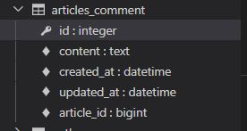

# DAY02

한 테이블의 필드 중 다른 테이블의 행을 식별할 수 있는 키를 외래 키 (FK foreign key) 라 한다


RDB 에서의 관계 

- 1 : 1
  - 고객이 단 한번의 주문만 할 수 있는 경우 
  - 거의 없다 

- N : 1
  - many-to-one relationships
  - 한 테이블(주문)의 0개 이상의 레코드가 다른 테이블(고객)의 레코드 한 개와 관련된 경우
  - 고객(1)은 여러 주문을 진행 할 수 있음
- M : N

### Foreign Key (FK)

- 외래 키
- 관계형 데이터 베이스에서 한 테이블의 필드(주문) 중 다른 테이블의 행(고객)을 식별할 수 있는 키
- 참조되는 측 테이블의 기본 키를 가리킴
- 참조하는 테이블 행 1개의 값은, 참조되는 측 테이블의 행 값에 대응됨
  - 참조하는 테이블의 행에는 참조되는 테이블에 나타나지 않는 값을 포함할 수 없음
- 참조하는 테이블 행 여러 개가, 참조되는 테이블의 동일한 행을 참조할 수 있음
- 키를 사용하여 부모 테이블의 유일한 값을 참조 (참조 무결성)
  - 2개의 테이블 간의 일관성이 있어야 함
  - 외래 키가 선언된 테이블의 외래 키 속성(열)의 값은 그 테이블의 부모가 되는 테이블의 기본 키 값으로 존재 해야 함
- 반드시 부모 테이블의 기본 키 일 필요는 없지만 유일한 값이어야 함

### N :  1

- 댓글 (Article에 종속)
- Comment(N) - Article(1)
- 내용, 생성일, 수정일, 외래키,

Foreingkey - **on_delete**

- 외래 키 위에 모델(참조하는 모델 클래스)을 받아와 준다, 외래 키가 참조하는 객체가 사라졌을 때 어떻게 처리할 지를 정의
- 데이터 무결성을 위해서 매우 중요한 설정

- CASCADE : 부모 객체가 삭제 됐을 때 이를 참조하는 객체도 삭제

[참조] 데이터 무결성

1. 개체 무결성
2. **참조 무결성**
3. 범위 무결성

```django
class Comment(models.Model):
    article =models.ForeignKey(Article, on_delete=models.CASCADE)
    # 외래키 위에 모델(참조하는 모델 클래스)을 받아와준다, 외래 키가 참조하는 객체가 사라졌을 때 어떻게 처리할지를 정의
    # 보기 편한 곳에 작성하면됨 실제론는 필드의 마지막에 작성 
    # 참조하는 모델 클래스의 단수형으로 작성 (아래 스키마 작성 때문에 단수로 사용)
    content = models.TextField()
    created_at = models.DateTimeField(auto_now_add=True)
    updated_at = models.DateTimeField(auto_now=True)


    def __str__(self):
        return self.content
```




```django
In [2]: comment = Comment()
# 클래스의 인스턴스 comment 생성
In [3]: comment.content = 'first comment'
# 인스턴스 변수 저장
In [4]: comment.save()
# 댓글 저장
# 에러발생
NOT NULL constraint failed: articles_comment.article_id
# 데이블의 Fkfield, article_id 값이 누락되었기 때문
In [8]: article = Article.objects.create(title='title', content='content')
# 게시물 생성
In [9]: article.pk
Out[9]: 1
# 생성된거 확인
In [10]: article
Out[10]: <Article: title>
#외래키 데이터 입력 (객체지향적인 표현)
In [11]: comment.article = article
# 댓글 저장
In [12]: comment.save()
# 저장확인
In [13]: comment.pk
Out[13]: 1

In [15]: comment.content
Out[15]: 'first comment'

In [17]: comment.article.content
Out[17]: 'content'

In [18]: comment= Comment(content='second comment',article=article)

In [19]: comment.save()
   
In [22]: comment.pk
Out[22]: 2
```

### 관계 모델 참조

- Django 는 모델 간 N : 1, M : N 관계가 설정되면 역참조할 때에 사용할 수 있는 manager를 생성
  - 이전에 모델 생성 시 objects라는 매니저를 통해 qureyset api를 사용했던 거처럼 related manager를 통해 qureyset api를 사용할 수 있게 됨
- 외래 키를 가지지 않은 1이 외래 키를 가진 N을 참조
- _set 
  - 역참조할 때 사용하는 매니저 
- 실제로 Article 클래스에는 Comment와의 어떠한 관계도 작성되어 있지 않음

```django
In [23]: article = Article.objects.get(pk=1)
# 1번 게시물 조회
In [24]: article.comment_set.all()
Out[24]: <QuerySet [<Comment: first comment>, <Comment: second comment>]>
    # 1번 게시글에 작성된 모든 댓글을 출력
In [25]: comments = article.comment_set.all()

In [26]: for comment in comments:
    ...:     print(comment.content)
    ...: 
first comment
second comment
```

related_name

- 작성 후, migration 과정이 필요(model이 수정되었기 때문)
- 선택 옵션이지만 상황에 따라 반드시 작성해야 하는 경우가 생김
- 역참조 시 사용하는 매니저 이름을 변경할 수 있음


#### CREATE

```python
# articles/forms.py
class CommentForm(forms.ModelForm):

    class Meta:
        model = Comment
        fields = '__all__'
        
# articles/views.py
from .forms import ArticleForm, CommentForm
def detail(request, pk):
    article = Article.objects.get(pk=pk)
    comment_form = CommentForm()
    context = {
        'article': article,
        'comment_form': comment_form,
    }
    return render(request, 'articles/detail.html', context)

# artciels/detail.html
  <form action="#" method='POST'>
    
    {{comment_form}}
    <input type="submit">
  </form>
```


사용자의 입력으로 받는 것이 아니라 view 함수 내에서 받아 별도로 처리 되어 저장