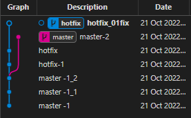

# DAY03

### Git 되돌리기(Undoing)

```python
touch 파일명 파일 생성
```

`git restore ` - 해당 파일을 직전 커밋 버전으로 돌린다

`git rm --caced 파일명` - root_commit 이 있을때 Working Directory로 되돌린다

`git restore --staged 파일명` - root_commit 이 없을때 Working Directory로 되돌린다

`git commit --amend` - 커밋을 완료한 파일을 Staging Area로 되돌리기

1. 입력모드 `i`
   - 문서 편집 가능
2. 명령모드(`esc`)
   - `dd` : 해당 줄 삭제
   - `:wq` : 저장 및 종료
     - `w` : 저장
     - `q` : 종료
   - `:q!` : 강제 종료
     - `q` : quit
     - `!` : 강제

`git reset` - 특정 커밋으로 되돌아 갔을 때 해당 커밋 이후로 쌓아 놨던 커밋들은 전부 사라진다

1. `--soft` 

   - 해당 커밋으로 되돌아가고,
   - 이후에 커밋된 파일들을 Staging Area로 돌려놓는다 (커밋하기 전 상태)

2. `--mixed`

   - 해당 커밋으로 되돌아가고,
   - 이후에 커밋된 파일들은 Working Directory로 돌려놓는다.(add 하기 전 상태)
   - git reset 옵션의 기본값

3. `--hard` 

   - 해당 커밋으로 되돌아가고 

   - 이후에 커밋된 파일들을 모두 Working Directory에서 삭제된다

   - 하지만 git은 이거 또한 기록하고 있다

   - reset을 하기 전으로 돌아가고 싶다면

   - `git reflog `를 이용하여 기록을 찾는다

   - 다시 돌아가고싶으면 

   - ```bash
     git reset --hard {commit Id}
     ```

   - 사용

`Branch` 독립적으로 작업할 수 있도록 도와주는 Git의 도구

- master(상용) 
- hotfix

```bash
$ git branch (목록 확인)
* master
$ git branch hotfix (추가하는 법)

$ git branch
  hotfix
* master

$ git switch hotfix	(브런치 변경하는 법)
Switched to branch 'hotfix'

/Desktop/git (hotfix) (master에서 hotfix로 변경)

똑같이 사용 하면 됨 
```



